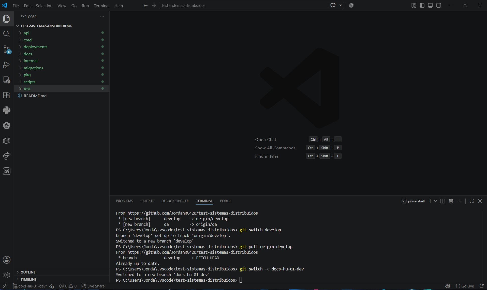
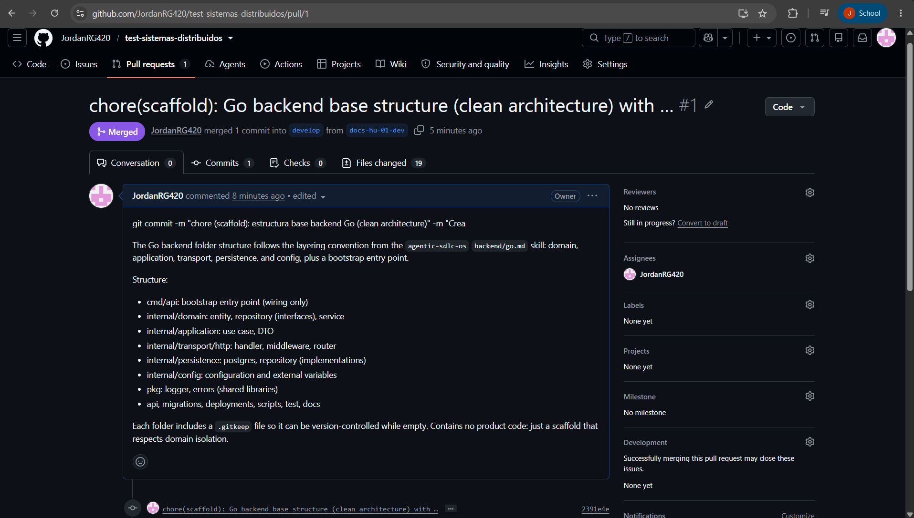

# Cherry-Pick Practice

**Date:** 08/12/2026

**Repository:** https://github.com/JordanRG420/test-sistemas-distribuidos

## Objective

Understand the Git workflow based on branches by creating a development branch from `develop`, making changes in an isolated environment, and later integrating those changes through a Pull Request. This exercise also serves as an introduction to **Cherry-Pick**, a Git feature that allows specific commits to be transferred between branches.

---

## What is Cherry-Pick?

> Cherry-Pick is a Git command that allows a specific commit from one branch to be applied to another branch without merging the complete branch history.

This approach is useful when only selected changes need to be propagated across branches such as `develop`, `qa`, or `main`.

---

## Workflow Performed

```text
develop
    │
    └── docs-hu-01-dev
             │
             │ Pull Request
             ▼
          develop
```

---

## Step 1. Creating the Working Branch

The `develop` branch was updated, and a new branch named `docs-hu-01-dev` was created to implement the User Story in an isolated environment.

```bash
git switch develop
git pull origin develop
git switch -c docs-hu-01-dev
```

### Evidence


---

## Step 2. Development of Changes

Within the `docs-hu-01-dev` branch, the base structure of a Go backend was created following Clean Architecture principles. The structure included directories dedicated to domain, application, persistence, configuration, and transport layers.

After the work was completed, the changes were recorded through a commit to maintain proper version control within the repository.

---

## Step 3. Integration Through Pull Request

Once the development work was finished, a Pull Request was created from `docs-hu-01-dev` to `develop` in order to integrate the implemented changes.

```text
docs-hu-01-dev → develop
```

The Pull Request was successfully reviewed and merged, making the new backend structure available in the development branch.

### Evidence



---

## Result

This practice demonstrated the use of Git branches for organized feature development. The changes were implemented in a separate branch and later integrated into `develop` through a successful Pull Request.

This workflow supports collaborative development by keeping features isolated until they are ready to be merged into the main development branch.

---

## Summary

| Step | Activity | Branch |
|--------|--------|--------|
| 1 | Update the base branch | `develop` |
| 2 | Create the working branch | `docs-hu-01-dev` |
| 3 | Develop the backend structure | `docs-hu-01-dev` |
| 4 | Create and merge the Pull Request | `develop` |

---

## Conclusion

This exercise provided an understanding of how development branches are created, how changes can be implemented independently, and how they are integrated through Pull Requests. It also introduced the concept of **Cherry-Pick**, which can later be used to move specific commits between different branches without performing a full merge.