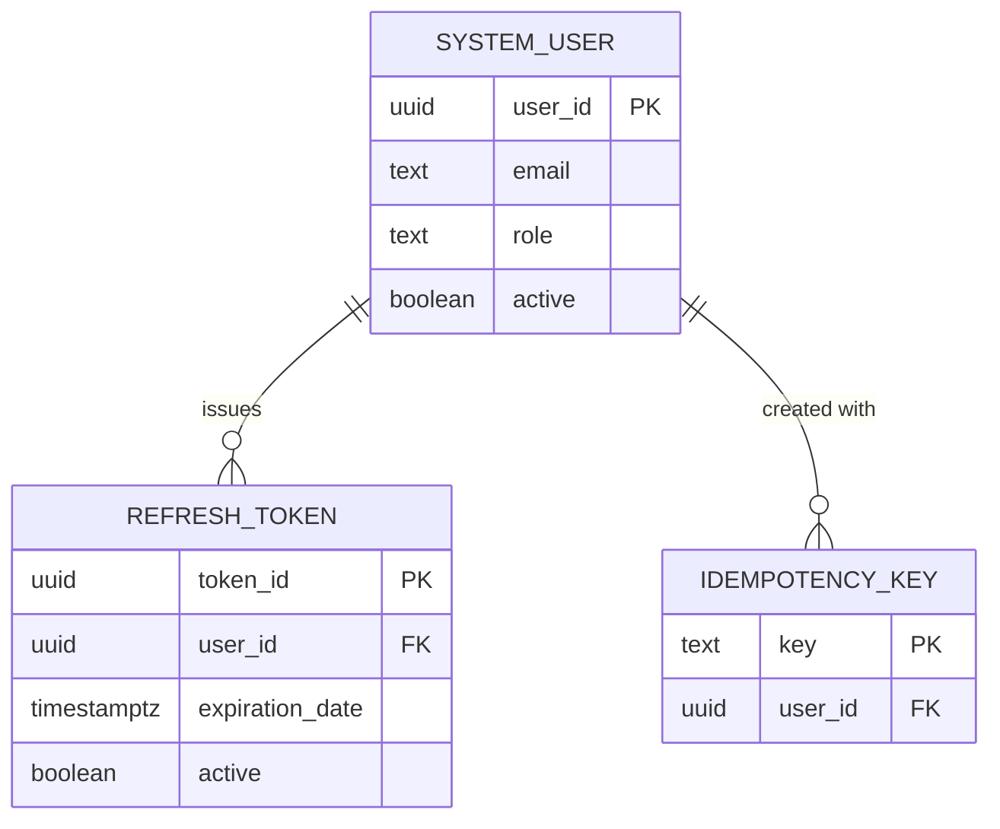
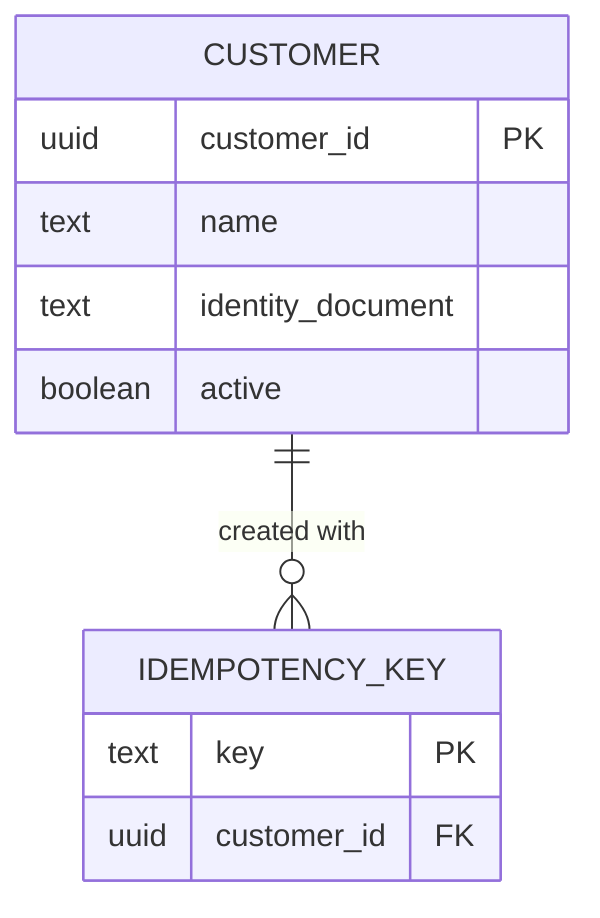
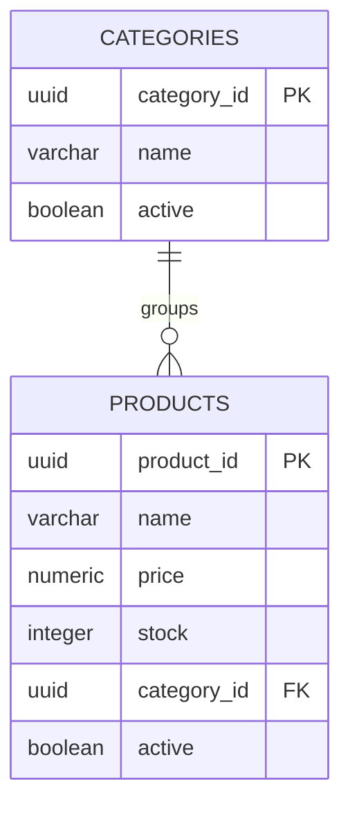
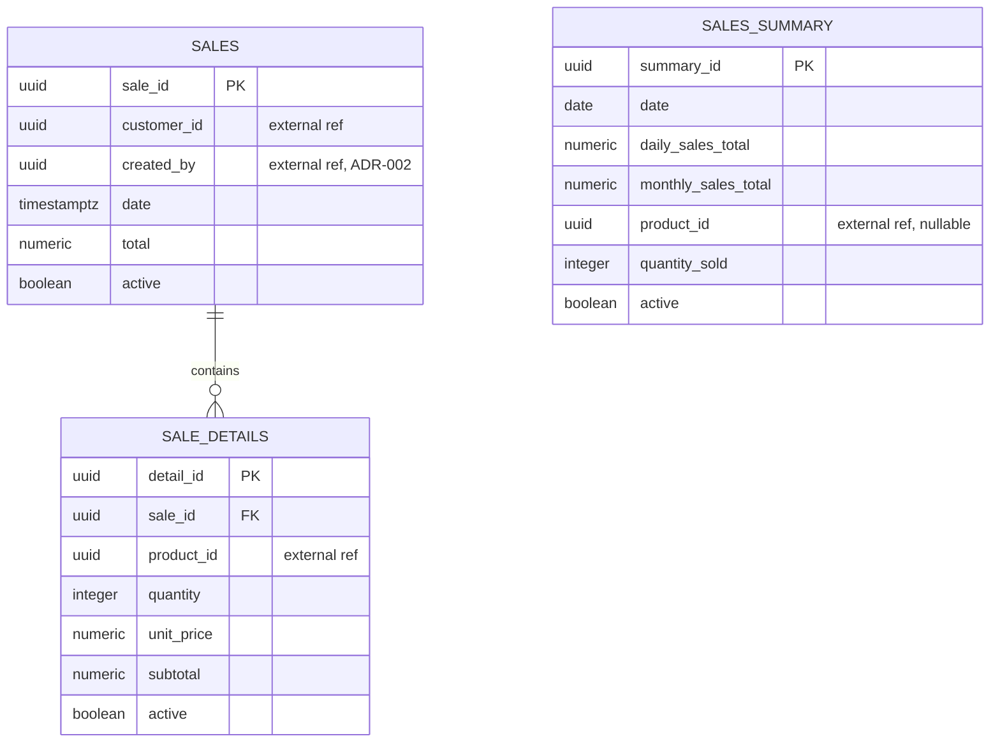

# Data Models per Domain

> The data model of each domain. Every domain has **its own PostgreSQL
> instance and database**, defined and migrated by its `synkro-<domain>-db`
> repository; no service connects to another domain's database (ADR-005).
>
> The field list comes from ADR-001 §7; ADR-005 changed the table names,
> the money types and the constraint conventions. This document gives the
> DDL each `-db` repository implements.

---

## Data modeling principles

### 1. Database per domain (mandatory)
A service reads and writes only its own database. Data from another domain
is requested through that domain's API, never with SQL.

```
✓ synkro-sales-api → sales-db (its own instance)
✓ sales portal     → GET /api/v1/customers/{id} → synkro-customers-api → customers-db
✗ synkro-sales-api → any connection to customers-db
```

### 2. Audit field: `active`, not `deleted_at`
Soft delete uses a boolean `active` field on every table, not the generic
`deleted_at` pattern. A row is considered deleted when `active = false`.
Timestamp fields keep their business names (`registration_date`, `date`).

### 3. Soft delete by default
Never delete a record with a physical `DELETE`. Set `active = false`
instead. This preserves traceability (NFR-009). The database enforces it:
the service's role has no `DELETE` permission (principle 6).

### 4. Conventions

| Element | Rule | Example |
|---|---|---|
| Schema | Named after the domain; nothing lives in `public` | `customers` |
| Tables | Singular `snake_case`, named after one row | `customer`, `sale_detail`, `system_user` (`user` is reserved) |
| Text | `text`, with a named `CHECK` on length when the business sets a limit | `chk_customer_name_length` |
| Closed sets | Named `CHECK`, never `ENUM` | `chk_system_user_role` |
| Money | `bigint` in minor units (1/100 COP), named `…_cents` | `price_cents` |
| Timestamps | `timestamptz` | `registration_date` |
| Constraints | Explicit names: `pk_<table>`, `fk_<table>_<target>`, `uq_<table>_<columns>`, `chk_<table>_<rule>` | `uq_customer_identity_document` |
| Foreign keys | Only inside the same domain; added after the tables, with `ON DELETE RESTRICT` and their own index | `fk_refresh_token_user` |
| External references | `<entity>_id` as a plain UUID, no foreign key, verified through the owning domain's API | `sale.customer_id` |
| Indexes | `idx_<table>_<columns>`; each one serves a known query | `idx_refresh_token_user_id` |

### 5. Migrations (Flyway)
Each `-db` repository organizes its migrations by family, with one version
sequence for the whole repository. The number, not the folder, decides the
order. Every `V<n>` has its rollback `U<n>` under `05_rollbacks/`, which
Flyway never runs on its own (ADR-005).

```
synkro-customers-db/
├── 01_ddl/01_schemas/V001__create_schema_customers.sql
├── 01_ddl/03_tables/V002__create_customer.sql
├── 01_ddl/03_tables/V003__create_idempotency_key.sql
├── 01_ddl/04_alter/V004__add_foreign_keys.sql
├── 01_ddl/10_indexes/V005__create_indexes.sql
├── 03_dcl/00_roles/V006__create_roles.sql
├── 03_dcl/01_grants/V007__grants.sql
├── 05_rollbacks/…/U001__create_schema_customers.sql … U007__grants.sql
├── deploy/compose.yml
├── deploy/init/create-app-user.sh
└── flyway.toml
```

### 6. Roles and credentials
- Migrations create only roles **without login or password**: `<domain>_reader` (`SELECT`) and `<domain>_writer` (`SELECT`, `INSERT`, `UPDATE`; no `DELETE`).
- Users with a password come from environment secrets, never from a repository:
  - **Owner** (`<DOMAIN>_DB_USER`): created by the PostgreSQL image; used only by the migration runner.
  - **Service user** (`<DOMAIN>_APP_USER`): created with login and no privileges by `deploy/init/create-app-user.sh` on the instance's first start.
- The last grant migration gives `<domain>_writer` to the service user through a Flyway placeholder that carries only its name (`FLYWAY_PLACEHOLDERS_APP_USER`).

### 7. Idempotency keys
Every domain that creates resources over HTTP has an `idempotency_key`
table. The service writes the resource and its key in **one transaction**;
if the key already exists, it rolls back and returns the original resource
(ADR-005). The key has 8 to 128 characters and a foreign key to the
resource it created.

---

## Domain: `auth`

**Instance:** `auth-db` · **Database and schema:** `auth` · **Repository:** `synkro-auth-db`

**Engine justification:** ACID guarantees are required for user credentials and role assignment — a user must never exist without a role. See `01-context/overview.md`, "Alternatives Considered".

```sql
-- 01_ddl/03_tables/V002__create_system_user.sql
CREATE TABLE auth.system_user (
  user_id            uuid        NOT NULL DEFAULT gen_random_uuid(),
  name               text        NOT NULL,
  email              text        NOT NULL,
  password_hash      text        NOT NULL,
  role               text        NOT NULL,
  registration_date  timestamptz NOT NULL DEFAULT now(),
  active             boolean     NOT NULL DEFAULT true,
  CONSTRAINT pk_system_user PRIMARY KEY (user_id),
  CONSTRAINT uq_system_user_email UNIQUE (email),
  CONSTRAINT chk_system_user_name_length CHECK (char_length(name) BETWEEN 1 AND 150),
  CONSTRAINT chk_system_user_email_length CHECK (char_length(email) BETWEEN 3 AND 255),
  CONSTRAINT chk_system_user_role CHECK (role IN ('ADMIN', 'SALESPERSON', 'INVENTORY'))
);

-- 01_ddl/03_tables/V003__create_refresh_token.sql
CREATE TABLE auth.refresh_token (
  token_id         uuid        NOT NULL DEFAULT gen_random_uuid(),
  user_id          uuid        NOT NULL,
  token            text        NOT NULL,   -- stores a hash, never the token itself
  expiration_date  timestamptz NOT NULL,
  active           boolean     NOT NULL DEFAULT true,
  CONSTRAINT pk_refresh_token PRIMARY KEY (token_id),
  CONSTRAINT uq_refresh_token_token UNIQUE (token)
);

-- 01_ddl/03_tables/V004__create_idempotency_key.sql
CREATE TABLE auth.idempotency_key (
  key         text        NOT NULL,
  user_id     uuid        NOT NULL,
  created_at  timestamptz NOT NULL DEFAULT now(),
  CONSTRAINT pk_idempotency_key PRIMARY KEY (key),
  CONSTRAINT chk_idempotency_key_length CHECK (char_length(key) BETWEEN 8 AND 128)
);

-- 01_ddl/04_alter/V005__add_foreign_keys.sql
ALTER TABLE auth.refresh_token ADD CONSTRAINT fk_refresh_token_user
  FOREIGN KEY (user_id) REFERENCES auth.system_user (user_id) ON DELETE RESTRICT;
ALTER TABLE auth.idempotency_key ADD CONSTRAINT fk_idempotency_key_user
  FOREIGN KEY (user_id) REFERENCES auth.system_user (user_id) ON DELETE RESTRICT;

-- 01_ddl/10_indexes/V006__create_indexes.sql
CREATE INDEX idx_refresh_token_user_id ON auth.refresh_token (user_id);
CREATE INDEX idx_idempotency_key_user_id ON auth.idempotency_key (user_id);

-- 03_dcl/00_roles/V007__create_roles.sql
CREATE ROLE auth_reader NOLOGIN;
CREATE ROLE auth_writer NOLOGIN;

-- 03_dcl/01_grants/V008__grants.sql
GRANT USAGE ON SCHEMA auth TO auth_reader, auth_writer;
GRANT SELECT ON ALL TABLES IN SCHEMA auth TO auth_reader;
GRANT SELECT, INSERT, UPDATE ON ALL TABLES IN SCHEMA auth TO auth_writer;
GRANT auth_writer TO "${app_user}";
```

- `system_user.role` never takes `SERVICE`: that role exists only inside service tokens (ADR-006).
- `idempotency_key` protects user registration. How service-token issuance is retried safely is defined with the auth contract.



---

## Domain: `customers`

**Instance:** `customers-db` · **Database and schema:** `customers` · **Repository:** `synkro-customers-db`

```sql
-- 01_ddl/03_tables/V002__create_customer.sql
CREATE TABLE customers.customer (
  customer_id        uuid        NOT NULL DEFAULT gen_random_uuid(),
  name               text        NOT NULL,
  identity_document  text        NOT NULL,
  email              text,
  phone              text,
  address            text,
  registration_date  timestamptz NOT NULL DEFAULT now(),
  active             boolean     NOT NULL DEFAULT true,
  CONSTRAINT pk_customer PRIMARY KEY (customer_id),
  CONSTRAINT uq_customer_identity_document UNIQUE (identity_document),
  CONSTRAINT chk_customer_name_length CHECK (char_length(name) BETWEEN 1 AND 150),
  CONSTRAINT chk_customer_identity_document_length CHECK (char_length(identity_document) BETWEEN 1 AND 30),
  CONSTRAINT chk_customer_email_length CHECK (email IS NULL OR char_length(email) <= 255),
  CONSTRAINT chk_customer_phone_length CHECK (phone IS NULL OR char_length(phone) <= 20),
  CONSTRAINT chk_customer_address_length CHECK (address IS NULL OR char_length(address) <= 255)
);

-- 01_ddl/03_tables/V003__create_idempotency_key.sql
CREATE TABLE customers.idempotency_key (
  key          text        NOT NULL,
  customer_id  uuid        NOT NULL,
  created_at   timestamptz NOT NULL DEFAULT now(),
  CONSTRAINT pk_idempotency_key PRIMARY KEY (key),
  CONSTRAINT chk_idempotency_key_length CHECK (char_length(key) BETWEEN 8 AND 128)
);

-- 01_ddl/04_alter/V004__add_foreign_keys.sql
ALTER TABLE customers.idempotency_key ADD CONSTRAINT fk_idempotency_key_customer
  FOREIGN KEY (customer_id) REFERENCES customers.customer (customer_id) ON DELETE RESTRICT;

-- 01_ddl/10_indexes/V005__create_indexes.sql
CREATE INDEX idx_idempotency_key_customer_id ON customers.idempotency_key (customer_id);

-- 03_dcl: V006 creates customers_reader and customers_writer; V007 grants them
-- exactly as in auth, and gives customers_writer to "${app_user}".
```

- `uq_customer_identity_document` also serves the point-of-sale lookup by identity document (ADR-004 Decision 1). The document is unique across all customers, active or not.
- `email`, `phone` and `address` are nullable: not every walk-in customer provides them.



---

## Schema: `products`

> **Pending update:** the `products` and `sales` sections below still use the
> previous conventions. HU-DOCS-47 rewrites them following principles 4 to 7.

**DB Engine:** PostgreSQL — schema `products`, owned by `products_user`.

### Table: `categories`

```sql
CREATE TABLE categories (
  category_id  UUID         PRIMARY KEY DEFAULT gen_random_uuid(),
  name         VARCHAR(100) NOT NULL UNIQUE,
  active       BOOLEAN      NOT NULL DEFAULT true
);
```

### Table: `products`

```sql
CREATE TABLE products (
  product_id   UUID           PRIMARY KEY DEFAULT gen_random_uuid(),
  name         VARCHAR(150)   NOT NULL,
  price        NUMERIC(12,2)  NOT NULL CHECK (price > 0),
  stock        INTEGER        NOT NULL DEFAULT 0 CHECK (stock >= 0),
  category_id  UUID           NOT NULL REFERENCES categories(category_id),
  active       BOOLEAN        NOT NULL DEFAULT true
);

CREATE INDEX idx_products_category_id ON products (category_id);
CREATE INDEX idx_products_name ON products (name);
CREATE INDEX idx_products_active ON products (active) WHERE active = true;
```

**Data dictionary:**

| Column | Type | Description |
|--------|------|-------------|
| price | NUMERIC(12,2) | Must be `> 0` — this constraint mirrors the `Product` invariant already fixed in `02-domain/entities-and-rules.md` |
| stock | INTEGER | Must be `>= 0`, never negative — same invariant, enforced at both the domain layer and the DB |
| category_id (FK) | UUID | Real FK to `categories` — same schema |



---

## Schema: `sales`

**DB Engine:** PostgreSQL — schema `sales`, owned by `sales_user`.

### Table: `sales`

```sql
CREATE TABLE sales (
  sale_id      UUID           PRIMARY KEY DEFAULT gen_random_uuid(),
  customer_id  UUID           NOT NULL,  -- external reference, see note below
  created_by   UUID           NOT NULL,  -- external reference to auth.users.user_id, see ADR-002
  date         TIMESTAMPTZ    NOT NULL DEFAULT NOW(),
  total        NUMERIC(14,2)  NOT NULL CHECK (total >= 0),
  active       BOOLEAN        NOT NULL DEFAULT true
);

CREATE INDEX idx_sales_customer_id ON sales (customer_id);
CREATE INDEX idx_sales_created_by ON sales (created_by);
CREATE INDEX idx_sales_date ON sales (date);
```

> **`customer_id` is not a database foreign key.** It references
> `customers.customer_id` in a different schema/service. Per ADR-003 §4,
> `synkro-workflow` validates the customer is real and `active = true` with a
> synchronous HTTP call to `customers-service` at sale creation time (Saga
> step 1), not with a DB constraint. This value is written into the `sales`
> row by `sales-service` when `workflow` calls `POST /api/sales` (Saga
> step 3) — `sales-service` itself does not perform this validation.
>
> **`created_by` is also an external reference** (added by ADR-002). It
> stores the `user_id` of the authenticated user who registered the sale,
> extracted from the JWT `sub` claim at creation time. Same validation
> pattern as `customer_id`: validated at runtime, not a database foreign
> key. This field enables the SALESPERSON role's "own sales" permission
> and resolves STRIDE threats R-3 and I-4.

### Table: `sale_details`

```sql
CREATE TABLE sale_details (
  detail_id    UUID           PRIMARY KEY DEFAULT gen_random_uuid(),
  sale_id      UUID           NOT NULL REFERENCES sales(sale_id),
  product_id   UUID           NOT NULL,  -- external reference, see note below
  quantity     INTEGER        NOT NULL CHECK (quantity > 0),
  unit_price   NUMERIC(12,2)  NOT NULL CHECK (unit_price > 0),
  subtotal     NUMERIC(14,2)  NOT NULL CHECK (subtotal = quantity * unit_price),
  active       BOOLEAN        NOT NULL DEFAULT true
);

CREATE INDEX idx_sale_details_sale_id ON sale_details (sale_id);
CREATE INDEX idx_sale_details_product_id ON sale_details (product_id);
```

> **`product_id` is also an external reference**, validated by
> `synkro-workflow` via a synchronous HTTP call to `products-service`
> (stock reservation and current price) at sale creation time — Saga step 2,
> same pattern as `sales.customer_id` above (ADR-003 §4).
>
> **`unit_price` is frozen at the moment of sale.** It is copied from the
> product's price when the line is created and never updated afterward,
> even if the product's price changes later — this mirrors the `SaleDetail`
> invariant already fixed in `02-domain/entities-and-rules.md`.

### Table: `sales_summary`

```sql
CREATE TABLE sales_summary (
  summary_id            UUID           PRIMARY KEY DEFAULT gen_random_uuid(),
  date                  DATE           NOT NULL,
  daily_sales_total     NUMERIC(14,2),
  monthly_sales_total   NUMERIC(14,2),
  product_id            UUID,          -- external reference, nullable
  quantity_sold         INTEGER,
  active                BOOLEAN        NOT NULL DEFAULT true
);

CREATE INDEX idx_sales_summary_date ON sales_summary (date);
```

### `outbox` (ADR-003 §5)

Guarantees reliable event publication to RabbitMQ after a sale is
created. Written in the same local transaction as the `sales` row —
a relay process reads unpublished rows and publishes them.

| Column | Type | Constraints | Description |
|--------|------|-------------|-------------|
| `id` | UUID | PK, DEFAULT `gen_random_uuid()` | Unique event identifier |
| `event_type` | VARCHAR(100) | NOT NULL | `SaleCompleted` or `SaleFailed` |
| `payload` | JSONB | NOT NULL | Full event data (sale_id, customer_id, items, total, timestamp) |
| `created_at` | TIMESTAMPTZ | DEFAULT `NOW()` | When the event was written |
| `published_at` | TIMESTAMPTZ | NULL | When the relay successfully published to RabbitMQ |
| `published` | BOOLEAN | DEFAULT `false` | Relay flag — `true` once published |

**Modeling decisions:**
1. This table belongs to the `sales` schema, not to a separate
  `workflow` schema — because the durable write it protects (the sale
  creation) happens here, and Outbox requires both writes in the same
  local transaction.
2. `synkro-workflow` does not have its own database — it is a stateless
  orchestrator. The professor confirmed this design by not creating a
  `synkro-workflow-db` repository.
3. The relay process is part of `sales-api`'s runtime (a background
  goroutine or scheduled task), not a separate service — it reads
  `outbox` rows where `published = false`, publishes to RabbitMQ, and
  sets `published = true` + `published_at`.

**Modeling decisions:**
1. `summary_id` is a synthetic primary key — ADR-001 names the table's business fields but not a PK, since every table needs one.
2. This table is intentionally denormalized (mixing daily total, monthly total, and top-product data in one row) to serve `GET /api/sales/reports/daily|monthly|top-products` without expensive aggregation joins on every request.
3. **Not populated in the MVP.** Per ADR-002, `sales_summary` exists in the schema because ADR-001 is immutable and names it, but it is not a domain entity and no process fills it. Reports (FR-008, FR-009) are served via aggregation queries directly over `sales` and `sale_details`. If data volume grows to the point where those queries degrade performance, this table would be activated as a materialization — see `pattern-guide.md` §4 (CQRS rejected for MVP).



---

## Correlations

- Domain entities and invariants these tables implement → `02-domain/entities-and-rules.md`
- Architectural decision fixing the original field list (immutable) → `ADR-001`, section 7
- Change adding `created_by` → `ADR-002`
- Roles used in `users.role` → `00-governance/security-policy.md`
- API endpoints that expose this data → `ADR-001`, section 8 ("Main APIs")
