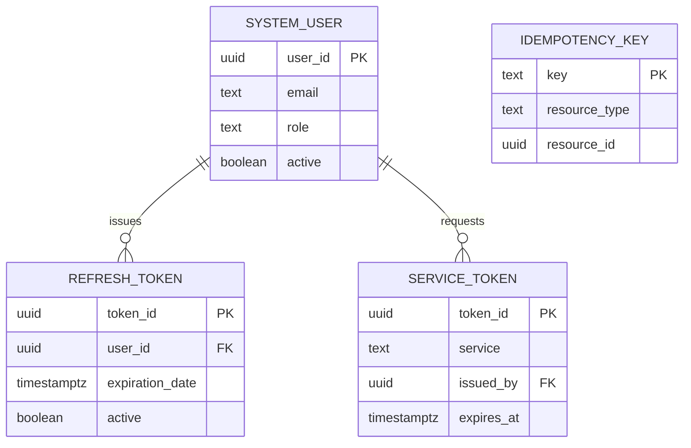
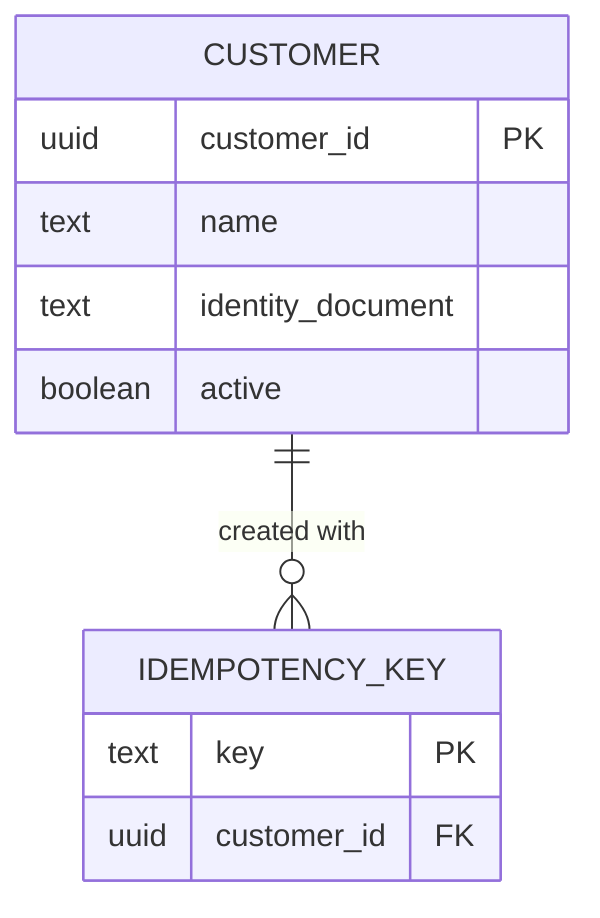
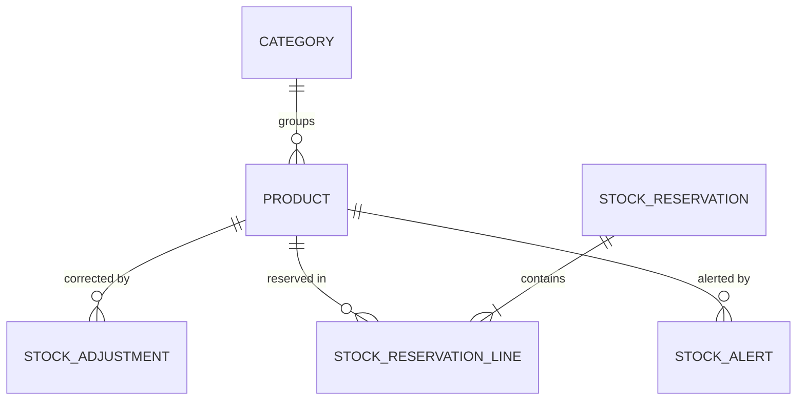
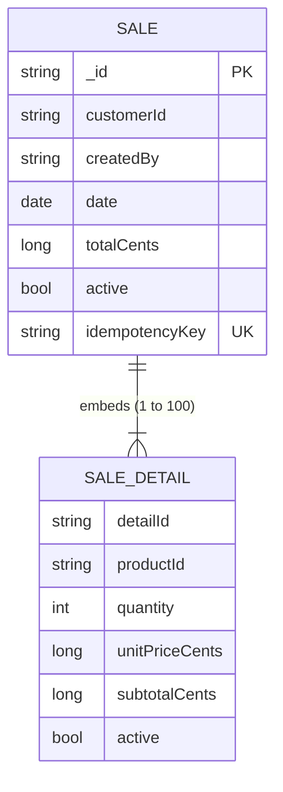

# Data Models per Domain

> The data model of each domain. The system uses two engines. Auth,
> Customers, Products and the saga store share **one PostgreSQL instance
> per environment**, defined and started by `synkro-infra-postgres`, each in its
> own schema (`<domain>_schema`). Sales has its own database in **one
> MongoDB instance per environment**, defined and started by
> `synkro-infra-mongo`. Every store is migrated by the `-db` repository
> of its domain, and no service connects to the store of another domain
> (ADR-009, ADR-010, ADR-012; ADR-005 Decisions 2–5).
>
> The field list comes from ADR-001 §7; ADR-005 changed the table names,
> the money types and the constraint conventions, and ADR-010 moved Sales
> to documents. This document gives what each `-db` repository implements.

---

## Data modeling principles

### 1. One store per domain (mandatory)
A service reads and writes only the store of its own domain: its schema in the shared PostgreSQL instance, or its database in the MongoDB instance. Data from another domain is requested through that domain's API, never by querying its store — not even inside the same instance. No `-db` grants its reader role to another domain's user (ADR-012).

```
✓ synkro-customers-api → customers_schema (shared PostgreSQL instance, user customers_app)
✓ synkro-sales-api     → database sales (MongoDB instance, user sales_app)
✓ sales portal         → GET /api/v1/customers/{id} → synkro-customers-api → customers_schema
✗ synkro-products-api  → any query against customers_schema (same instance, but no GRANT)
✗ any other service    → the MongoDB instance (no credentials)
```

### 2. Audit field: `active`, not `deleted_at`
Soft delete uses a boolean `active` field on every table whose rows can be
deactivated, not the generic `deleted_at` pattern. A row is considered
deleted when `active = false`. Records that are never edited (stock
adjustments, reservation lines, idempotency keys) have no `active` field,
and records with a lifecycle (reservations, alerts, sagas) use a `status`.
Timestamp fields keep their business names (`registration_date`, `date`).

### 3. Soft delete by default
Never delete a record with a physical `DELETE`. Set `active = false`
instead. This preserves traceability (NFR-009). The database enforces it:
the service's role has no `DELETE` permission (principle 6).

In MongoDB the rule is the same: the role `sales_writer` can find, insert and update, and has no action to remove documents.

### 4. Conventions (PostgreSQL) 

| Element | Rule | Example |
|---|---|---|
| Schema | Named after the domain with `_schema` suffix; nothing lives in `public` | `customers_schema` |
| Tables | Singular `snake_case`, named after one row | `customer`, `stock_reservation_line`, `system_user` (`user` is reserved) |
| Text | `text`, with a named `CHECK` on length when the business sets a limit | `chk_customer_name_length` |
| Closed sets | Named `CHECK`, never `ENUM` | `chk_system_user_role` |
| Money | `bigint` in minor units (1/100 COP), named `…_cents` | `price_cents` |
| Timestamps | `timestamptz` | `registration_date` |
| Constraints | Explicit names: `pk_<table>`, `fk_<table>_<target>`, `uq_<table>_<columns>`, `chk_<table>_<rule>` | `uq_customer_identity_document` |
| Foreign keys | Only inside the same domain; added after the tables, with `ON DELETE RESTRICT` and their own index | `fk_refresh_token_user` |
| External references | `<entity>_id` as a plain UUID, no foreign key, verified through the owning domain's API | `stock_adjustment.adjusted_by` |
| Indexes | `idx_<table>_<columns>`; each one serves a known query | `idx_refresh_token_user_id` |

### 4b. Conventions (MongoDB, Sales)

| Element | Rule | Example |
|---|---|---|
| Database | One per domain inside the instance, named after the domain | `sales` |
| Collections | Singular `snake_case`, named after one document | `sale` |
| Fields | camelCase, the same names as the API contract | `totalCents`, `createdBy` |
| Structure | A `$jsonSchema` validator on every collection, with `additionalProperties: false`, `validationLevel: strict` and `validationAction: error` | undeclared fields are rejected |
| Identifiers | Canonical UUID as text; the document's `_id` is the entity's identifier | `_id` is `saleId` |
| Money | `long` in minor units (1/100 COP), named `…Cents`; never `double` | `unitPriceCents` |
| Timestamps | `date`, stored in UTC | `date` |
| Relationships | Embed what is read together; every embedded array declares `minItems` and `maxItems` | `details`, 1 to 100 |
| External references | `<entity>Id` as a plain UUID, verified through the owning domain's API | `customerId` |
| Uniqueness | Unique indexes, named `uq_<collection>_<fields>` | `uq_sale_idempotency_key` |
| Indexes | `idx_<collection>_<fields>`; each one serves a known query | `idx_sale_created_by_date` |
| Rules between fields | Enforced by the service's domain, with tests; the validator checks only types and ranges | `subtotalCents = quantity * unitPriceCents` |

### 5. Migrations 
Each `-db` repository organizes its migrations by family, with one version sequence for the whole repository. The number, not the folder, decides the order. Every `V<n>` has its rollback `U<n>` under `05_rollbacks/`, which Flyway never runs on its own (ADR-005).

`flyway.toml` declares the domain's schema as its only schema and its default schema, so the migration history table lives inside `<domain>_schema` and no two repositories share it (ADR-012). The CI rebuild check drops that table before the `U` script that drops the schema.

**Sales (Liquibase).** `synkro-sales-db` uses Liquibase with its MongoDB extension (ADR-010). `changelog/changelog-master.yaml` is the only entry point and includes each family in order. Every changeset is idempotent on its own and declares its inverse in line; there are no folders for foreign keys, transaction control or mirrored rollbacks.

```
synkro-sales-db/
├── 01_ddl/00_collections/changelog.yaml   # sale, created with its validator
├── 01_ddl/01_validators/changelog.yaml    # later validator changes (collMod); empty at first
├── 01_ddl/02_indexes/changelog.yaml       # the four indexes of the sale collection
├── 01_ddl/03_views/changelog.yaml         # empty: reports are pipelines in the service
├── 01_ddl/changelog.yaml
├── 02_dml/…/changelog.yaml                # idempotent seeds; empty at first
├── 03_dcl/00_roles/changelog.yaml         # sales_reader, sales_writer, grant to sales_app
├── changelog/changelog-master.yaml
└── deploy/compose.yml, deploy/liquibase.Dockerfile   # the runner only
```

A validator is never changed by editing the changeset that created the collection: the change is a new changeset under `01_validators/`. The CI check applies everything on an empty database, applies again with zero changes, rolls everything back and applies again; it also inserts one valid document and confirms that an undeclared field, an out-of-range value and a sale with 101 lines are rejected.

### 6. Schemas, roles and credentials
- **Created only by the `-db`.** Each `-db` repository, and `synkro-workflow` for the saga store, creates its schema (`<domain>_schema`) and its roles **without login or password**: `<domain>_reader` (`SELECT`) and `<domain>_writer` (`SELECT`, `INSERT`, `UPDATE`; no `DELETE`). Nothing else creates them (ADR-012).
- **Service users, created by the instance.** The bootstrap script of `synkro-infra-postgres` creates one login user per domain — `auth_app`, `customers_app`, `products_app`, `workflow_app` — with its `search_path` set to its schema and no privilege of its own. The user name is fixed; only its password is a secret (`<DOMAIN>_APP_PASSWORD`). In the CI of a `-db`, which rebuilds on an ephemeral instance without that script, the job creates the user before migrating.
- **The grant.** The last grant migration gives `<domain>_writer` to `<domain>_app` by name. It fails if the user does not exist, so a missing service user is detected, not hidden.
- **Who connects as what.** Services connect as `<domain>_app`, never as the administrator. Migration runners connect with the instance administrator's credentials, which nothing else uses.
- **Sales.** `synkro-sales-db` creates the roles `sales_reader` (find) and `sales_writer` (find, insert, update; no remove) in the `sales` database, and grants `sales_writer` to `sales_app`. The bootstrap script of `synkro-infra-mongo` creates `sales_app`.
- **Check.** After migrating an environment, the privilege check of `05-architecture/deployment.md` must show each `_app` user reading and writing only its own schema.

### 7. Idempotency keys
Every domain that creates resources over HTTP stores the `Idempotency-Key`
of each creation. The key has 8 to 128 characters.

- **PostgreSQL domains:** an `idempotency_key` table. The service writes the
  resource and its key in **one transaction**; if the key already exists, it
  rolls back and returns the original resource (ADR-005). When a domain
  creates one kind of resource, the key has a foreign key to it; when it
  creates several, it stores the resource type and identifier
  (`resource_type`, `resource_id`).
- **Sales:** the key is the field `idempotencyKey` of the sale document, with
  the unique index `uq_sale_idempotency_key`. The sale and its key are one
  atomic write; if the index rejects the insert, the service reads the sale
  that holds the key and returns it (ADR-010).

---

## Domain: `auth`

**Schema:** `auth_schema` (shared instance) · **Repository:** `synkro-auth-db`

**Engine justification:** ACID guarantees are required for user credentials and role assignment — a user must never exist without a role. See `01-context/overview.md`, "Alternatives Considered".

```sql
-- 01_ddl/01_schemas/V001__create_auth_schema.sql
CREATE SCHEMA IF NOT EXISTS auth_schema;

-- 01_ddl/03_tables/V002__create_system_user.sql
CREATE TABLE auth_schema.system_user (
  user_id            uuid        NOT NULL DEFAULT gen_random_uuid(),
  name               text        NOT NULL,
  email              text        NOT NULL,
  password_hash      text        NOT NULL,
  role               text        NOT NULL,
  registration_date  timestamptz NOT NULL DEFAULT now(),
  active             boolean     NOT NULL DEFAULT true,
  CONSTRAINT pk_system_user PRIMARY KEY (user_id),
  CONSTRAINT uq_system_user_email UNIQUE (email),
  CONSTRAINT chk_system_user_name_length CHECK (char_length(name) BETWEEN 1 AND 150),
  CONSTRAINT chk_system_user_email_length CHECK (char_length(email) BETWEEN 3 AND 255),
  CONSTRAINT chk_system_user_role CHECK (role IN ('ADMIN', 'SALESPERSON', 'INVENTORY'))
);

-- 01_ddl/03_tables/V003__create_refresh_token.sql
CREATE TABLE auth_schema.refresh_token (
  token_id         uuid        NOT NULL DEFAULT gen_random_uuid(),
  user_id          uuid        NOT NULL,
  token            text        NOT NULL,   -- stores a hash, never the token itself
  expiration_date  timestamptz NOT NULL,
  active           boolean     NOT NULL DEFAULT true,
  CONSTRAINT pk_refresh_token PRIMARY KEY (token_id),
  CONSTRAINT uq_refresh_token_token UNIQUE (token)
);

-- 01_ddl/03_tables/V004__create_idempotency_key.sql
CREATE TABLE auth_schema.idempotency_key (
  key            text        NOT NULL,
  resource_type  text        NOT NULL,
  resource_id    uuid        NOT NULL,
  created_at     timestamptz NOT NULL DEFAULT now(),
  CONSTRAINT pk_idempotency_key PRIMARY KEY (key),
  CONSTRAINT chk_idempotency_key_length CHECK (char_length(key) BETWEEN 8 AND 128),
  CONSTRAINT chk_idempotency_key_resource_type CHECK (resource_type IN ('USER', 'SERVICE_TOKEN'))
);

-- 01_ddl/03_tables/V005__create_service_token.sql
CREATE TABLE auth_schema.service_token (
  token_id     uuid        NOT NULL,   -- the jti of the token, generated by the domain
  service      text        NOT NULL,
  permissions  text[]      NOT NULL,
  issued_by    uuid        NOT NULL,   -- the ADMIN who requested it
  issued_at    timestamptz NOT NULL DEFAULT now(),
  expires_at   timestamptz NOT NULL,
  CONSTRAINT pk_service_token PRIMARY KEY (token_id),
  CONSTRAINT chk_service_token_service CHECK (service IN ('synkro-workflow', 'synkro-worker')),
  CONSTRAINT chk_service_token_expiry CHECK (expires_at > issued_at)
);

-- 01_ddl/04_alter/V006__add_foreign_keys.sql
ALTER TABLE auth_schema.refresh_token ADD CONSTRAINT fk_refresh_token_user
  FOREIGN KEY (user_id) REFERENCES auth_schema.system_user (user_id) ON DELETE RESTRICT;
ALTER TABLE auth_schema.service_token ADD CONSTRAINT fk_service_token_issued_by
  FOREIGN KEY (issued_by) REFERENCES auth_schema.system_user (user_id) ON DELETE RESTRICT;

-- 01_ddl/10_indexes/V007__create_indexes.sql
CREATE INDEX idx_refresh_token_user_id ON auth_schema.refresh_token (user_id);
CREATE INDEX idx_service_token_issued_by ON auth_schema.service_token (issued_by);

-- 03_dcl/00_roles/V008__create_roles.sql   (PostgreSQL has no CREATE ROLE IF NOT EXISTS)
DO $$
BEGIN
  IF NOT EXISTS (SELECT FROM pg_roles WHERE rolname = 'auth_reader') THEN
    CREATE ROLE auth_reader NOLOGIN;
  END IF;
  IF NOT EXISTS (SELECT FROM pg_roles WHERE rolname = 'auth_writer') THEN
    CREATE ROLE auth_writer NOLOGIN;
  END IF;
END
$$;

-- 03_dcl/01_grants/V009__grants.sql
GRANT USAGE ON SCHEMA auth_schema TO auth_reader, auth_writer;
GRANT SELECT ON ALL TABLES IN SCHEMA auth_schema TO auth_reader;
GRANT SELECT, INSERT, UPDATE ON ALL TABLES IN SCHEMA auth_schema TO auth_writer;
GRANT auth_writer TO "${app_user}";
```

- `system_user.role` never takes `SERVICE`: that role exists only inside service tokens (ADR-006).
- `idempotency_key` protects both creations of this domain, user registration and service-token issuance, so it stores the type and the identifier of the resource, like Products (principle 7). A retried issuance finds its key, reads the token's metadata from `service_token` and returns it without the token (ADR-004 Decision 7).
- `service_token` keeps only metadata: the service it was issued to, its permissions and its dates, so an issuance can be confirmed and its expiry tracked. The signed token is shown once and lives only in the `SERVICE_TOKEN` secret (ADR-006); it is never stored.



---

## Domain: `customers`

**Schema:** `customers_schema` (shared instance) · **Repository:** `synkro-customers-db`

```sql
-- 01_ddl/03_tables/V002__create_customer.sql
CREATE TABLE customers_schema.customer (
  customer_id        uuid        NOT NULL DEFAULT gen_random_uuid(),
  name               text        NOT NULL,
  identity_document  text        NOT NULL,
  email              text,
  phone              text,
  address            text,
  registration_date  timestamptz NOT NULL DEFAULT now(),
  active             boolean     NOT NULL DEFAULT true,
  CONSTRAINT pk_customer PRIMARY KEY (customer_id),
  CONSTRAINT uq_customer_identity_document UNIQUE (identity_document),
  CONSTRAINT chk_customer_name_length CHECK (char_length(name) BETWEEN 1 AND 150),
  CONSTRAINT chk_customer_identity_document_length CHECK (char_length(identity_document) BETWEEN 1 AND 30),
  CONSTRAINT chk_customer_email_length CHECK (email IS NULL OR char_length(email) <= 255),
  CONSTRAINT chk_customer_phone_length CHECK (phone IS NULL OR char_length(phone) <= 20),
  CONSTRAINT chk_customer_address_length CHECK (address IS NULL OR char_length(address) <= 255)
);

-- 01_ddl/03_tables/V003__create_idempotency_key.sql
CREATE TABLE customers_schema.idempotency_key (
  key          text        NOT NULL,
  customer_id  uuid        NOT NULL,
  created_at   timestamptz NOT NULL DEFAULT now(),
  CONSTRAINT pk_idempotency_key PRIMARY KEY (key),
  CONSTRAINT chk_idempotency_key_length CHECK (char_length(key) BETWEEN 8 AND 128)
);

-- 01_ddl/04_alter/V004__add_foreign_keys.sql
ALTER TABLE customers_schema.idempotency_key ADD CONSTRAINT fk_idempotency_key_customer
  FOREIGN KEY (customer_id) REFERENCES customers_schema.customer (customer_id) ON DELETE RESTRICT;

-- 01_ddl/10_indexes/V005__create_indexes.sql
CREATE INDEX idx_idempotency_key_customer_id ON customers_schema.idempotency_key (customer_id);

-- V001 creates customers_schema (CREATE SCHEMA IF NOT EXISTS).
-- 03_dcl: V006 creates customers_reader and customers_writer (idempotent, as in auth); V007 grants them
-- exactly as in auth, and gives customers_writer to "${app_user}".
```

- `uq_customer_identity_document` also serves the point-of-sale lookup by identity document (ADR-004 Decision 1). The document is unique across all customers, active or not.
- `email`, `phone` and `address` are nullable: not every walk-in customer provides them.



---

## Domain: `products`

**Schema:** `products_schema` (shared instance) · **Repository:** `synkro-products-db`

```sql
-- 01_ddl/03_tables/V002__create_category.sql
CREATE TABLE products_schema.category (
  category_id  uuid    NOT NULL DEFAULT gen_random_uuid(),
  name         text    NOT NULL,
  active       boolean NOT NULL DEFAULT true,
  CONSTRAINT pk_category PRIMARY KEY (category_id),
  CONSTRAINT chk_category_name_length CHECK (char_length(name) BETWEEN 1 AND 100)
);
-- 01_ddl/03_tables/V003__create_product.sql
CREATE TABLE products_schema.product (
  product_id   uuid    NOT NULL DEFAULT gen_random_uuid(),
  name         text    NOT NULL,
  price_cents  bigint  NOT NULL,
  stock        integer NOT NULL DEFAULT 0,
  category_id  uuid    NOT NULL,
  active       boolean NOT NULL DEFAULT true,
  CONSTRAINT pk_product PRIMARY KEY (product_id),
  CONSTRAINT chk_product_name_length CHECK (char_length(name) BETWEEN 1 AND 150),
  CONSTRAINT chk_product_price_cents CHECK (price_cents > 0),
  CONSTRAINT chk_product_stock CHECK (stock >= 0)
);
-- 01_ddl/03_tables/V004__create_stock_adjustment.sql
CREATE TABLE products_schema.stock_adjustment (
  adjustment_id  uuid        NOT NULL DEFAULT gen_random_uuid(),
  product_id     uuid        NOT NULL,
  delta          integer     NOT NULL,
  reason         text        NOT NULL,
  adjusted_by    uuid        NOT NULL,   -- external reference: sub of the validated token
  adjusted_at    timestamptz NOT NULL DEFAULT now(),
  CONSTRAINT pk_stock_adjustment PRIMARY KEY (adjustment_id),
  CONSTRAINT chk_stock_adjustment_delta CHECK (delta <> 0),
  CONSTRAINT chk_stock_adjustment_reason_length CHECK (char_length(reason) BETWEEN 1 AND 255)
);
-- 01_ddl/03_tables/V005__create_stock_reservation.sql
CREATE TABLE products_schema.stock_reservation (
  reservation_id  uuid        NOT NULL DEFAULT gen_random_uuid(),
  status          text        NOT NULL DEFAULT 'RESERVED',
  created_at      timestamptz NOT NULL DEFAULT now(),
  released_at     timestamptz,
  CONSTRAINT pk_stock_reservation PRIMARY KEY (reservation_id),
  CONSTRAINT chk_stock_reservation_status CHECK (status IN ('RESERVED', 'RELEASED')),
  CONSTRAINT chk_stock_reservation_released_at CHECK ((status = 'RELEASED') = (released_at IS NOT NULL))
);
-- 01_ddl/03_tables/V006__create_stock_reservation_line.sql
CREATE TABLE products_schema.stock_reservation_line (
  line_id           uuid    NOT NULL DEFAULT gen_random_uuid(),
  reservation_id    uuid    NOT NULL,
  product_id        uuid    NOT NULL,
  quantity          integer NOT NULL,
  unit_price_cents  bigint  NOT NULL,   -- price frozen when the stock is reserved
  CONSTRAINT pk_stock_reservation_line PRIMARY KEY (line_id),
  CONSTRAINT uq_stock_reservation_line_product UNIQUE (reservation_id, product_id),
  CONSTRAINT chk_stock_reservation_line_quantity CHECK (quantity > 0),
  CONSTRAINT chk_stock_reservation_line_unit_price_cents CHECK (unit_price_cents > 0)
);
-- 01_ddl/03_tables/V007__create_stock_alert.sql
CREATE TABLE products_schema.stock_alert (
  alert_id          uuid        NOT NULL DEFAULT gen_random_uuid(),
  product_id        uuid        NOT NULL,
  status            text        NOT NULL DEFAULT 'OPEN',
  stock_at_opening  integer     NOT NULL,
  opened_at         timestamptz NOT NULL DEFAULT now(),
  resolved_at       timestamptz,
  CONSTRAINT pk_stock_alert PRIMARY KEY (alert_id),
  CONSTRAINT chk_stock_alert_status CHECK (status IN ('OPEN', 'RESOLVED')),
  CONSTRAINT chk_stock_alert_stock_at_opening CHECK (stock_at_opening >= 0),
  CONSTRAINT chk_stock_alert_resolved_at CHECK ((status = 'RESOLVED') = (resolved_at IS NOT NULL))
);
-- 01_ddl/03_tables/V008__create_idempotency_key.sql
CREATE TABLE products_schema.idempotency_key (
  key            text        NOT NULL,
  resource_type  text        NOT NULL,
  resource_id    uuid        NOT NULL,
  created_at     timestamptz NOT NULL DEFAULT now(),
  CONSTRAINT pk_idempotency_key PRIMARY KEY (key),
  CONSTRAINT chk_idempotency_key_length CHECK (char_length(key) BETWEEN 8 AND 128),
  CONSTRAINT chk_idempotency_key_resource_type CHECK (resource_type IN
    ('PRODUCT', 'CATEGORY', 'STOCK_ADJUSTMENT', 'STOCK_RESERVATION', 'STOCK_ALERT'))
);
-- 01_ddl/04_alter/V009__add_foreign_keys.sql, all ON DELETE RESTRICT: fk_product_category, fk_stock_adjustment_product,
--   fk_stock_reservation_line_reservation, fk_stock_reservation_line_product, fk_stock_alert_product
-- 01_ddl/10_indexes/V010__create_indexes.sql
CREATE UNIQUE INDEX uq_category_name_active ON products_schema.category (name) WHERE active;
CREATE UNIQUE INDEX uq_stock_alert_open_product ON products_schema.stock_alert (product_id) WHERE status = 'OPEN';
CREATE INDEX idx_product_category_id ON products_schema.product (category_id);
CREATE INDEX idx_product_name ON products_schema.product (name);
CREATE INDEX idx_product_stock ON products_schema.product (stock) WHERE active;   -- the worker's low-stock query
CREATE INDEX idx_stock_adjustment_product_id ON products_schema.stock_adjustment (product_id);
CREATE INDEX idx_stock_reservation_line_product_id ON products_schema.stock_reservation_line (product_id);
CREATE INDEX idx_stock_alert_product_id ON products_schema.stock_alert (product_id);
-- V001 creates products_schema (CREATE SCHEMA IF NOT EXISTS).
-- 03_dcl: V011 creates products_reader/products_writer (idempotent, as in auth); V012 grants them as in auth, and products_writer to "${app_user}".
```

- **Stock changes only through a reservation or an adjustment.** Creating a reservation decreases `product.stock` for every line in **one transaction**, and `chk_product_stock` makes it fail as a whole if any line would go below zero. Releasing restores the stock once, only if the reservation was `RESERVED`.
- Category names are unique among active categories only; a product has at most one `OPEN` alert. Releasing a reservation and resolving an alert are idempotent by their status, so they need no idempotency key.



---

## Domain: `sales`

**Database:** `sales` (MongoDB instance) · **Collection:** `sale` · **Repository:** `synkro-sales-db`

**Engine justification:** a sale is written once with all its lines and always read whole, and no other domain references it. One document stores it as the domain defines it, in one atomic write (ADR-010).

Validator of the collection, created with it (`validationLevel: strict`, `validationAction: error`):

```json
{
  "$jsonSchema": {
    "bsonType": "object",
    "additionalProperties": false,
    "required": ["_id", "customerId", "createdBy", "date", "totalCents", "active", "idempotencyKey", "details"],
    "properties": {
      "_id":            { "bsonType": "string", "pattern": "^[0-9a-f]{8}-[0-9a-f]{4}-[0-9a-f]{4}-[0-9a-f]{4}-[0-9a-f]{12}$" },
      "customerId":     { "bsonType": "string", "pattern": "^[0-9a-f]{8}-[0-9a-f]{4}-[0-9a-f]{4}-[0-9a-f]{4}-[0-9a-f]{12}$" },
      "createdBy":      { "bsonType": "string", "pattern": "^[0-9a-f]{8}-[0-9a-f]{4}-[0-9a-f]{4}-[0-9a-f]{4}-[0-9a-f]{12}$" },
      "date":           { "bsonType": "date" },
      "totalCents":     { "bsonType": "long", "minimum": 0 },
      "active":         { "bsonType": "bool" },
      "idempotencyKey": { "bsonType": "string", "minLength": 8, "maxLength": 128 },
      "details": {
        "bsonType": "array",
        "minItems": 1,
        "maxItems": 100,
        "items": {
          "bsonType": "object",
          "additionalProperties": false,
          "required": ["detailId", "productId", "quantity", "unitPriceCents", "subtotalCents", "active"],
          "properties": {
            "detailId":       { "bsonType": "string", "pattern": "^[0-9a-f]{8}-[0-9a-f]{4}-[0-9a-f]{4}-[0-9a-f]{4}-[0-9a-f]{12}$" },
            "productId":      { "bsonType": "string", "pattern": "^[0-9a-f]{8}-[0-9a-f]{4}-[0-9a-f]{4}-[0-9a-f]{4}-[0-9a-f]{12}$" },
            "quantity":       { "bsonType": "int",  "minimum": 1 },
            "unitPriceCents": { "bsonType": "long", "minimum": 1 },
            "subtotalCents":  { "bsonType": "long", "minimum": 1 },
            "active":         { "bsonType": "bool" }
          }
        }
      }
    }
  }
}
```

Indexes, each for a query of `synkro-sales-api.yaml`:

| Index | Keys | Serves |
|---|---|---|
| `idx_sale_date` | `date` descending | Sale list and reports, newest first |
| `idx_sale_created_by_date` | `createdBy`, `date` descending | A salesperson's own sales and own reports |
| `idx_sale_customer_id_date` | `customerId`, `date` descending | Sale list filtered by customer |
| `uq_sale_idempotency_key` | `idempotencyKey`, unique | A retried registration returns the same sale |

Roles: `sales_reader` (find) and `sales_writer` (find, insert, update; no remove), created without password; `sales_writer` is granted to `sales_app`.

- `customerId` and `details[].productId` point to other domains: the saga checks the customer and reserves the products before the document is written (ADR-007). `createdBy` is sent by the saga and accepted only from a caller holding `sales:register` (ADR-006).
- `details[].unitPriceCents` is the price frozen by the reservation.
- `subtotalCents = quantity * unitPriceCents` and `totalCents = sum of subtotalCents` are enforced by the domain of `synkro-sales-api`, with its tests: the validator checks only types and ranges.
- A sale has at most 100 lines. `synkro-workflow` rejects a longer request before running any step.
- There is no `outbox` (ADR-007) and no summary collection (ADR-005 Decision 5): reports are aggregation pipelines over `sale`, filtered first by `active`, date range and, for a SALESPERSON, `createdBy` (ADR-002, ADR-010 Decision 4).



`SALE_DETAIL` is not a collection: it is the element of the `details` array inside each `sale` document.

---

## Saga store: `workflow`

**Schema:** `workflow_schema` (shared instance) · **Repository:** `synkro-workflow`, under `db/` with the same layout. It holds the orchestrator's internal state, not a domain schema; only `synkro-workflow` connects to it, with its own credentials (ADR-007, ADR-009).

```sql
-- db/01_ddl/01_schemas/V001__create_workflow_schema.sql: CREATE SCHEMA IF NOT EXISTS workflow_schema (same pattern as the domains)
-- db/01_ddl/03_tables/V002__create_saga_instance.sql
CREATE TABLE workflow_schema.saga_instance (
  saga_id          uuid        NOT NULL DEFAULT gen_random_uuid(),
  saga_type        text        NOT NULL,
  idempotency_key  text        NOT NULL,
  status           text        NOT NULL DEFAULT 'RUNNING',
  initiated_by     uuid        NOT NULL,   -- sub of the person's validated token (ADR-006)
  input            jsonb       NOT NULL,   -- customer and lines, as requested
  step_results     jsonb       NOT NULL DEFAULT '{}'::jsonb,   -- reservation id, prices, sale id
  completed_steps  text[]      NOT NULL DEFAULT '{}',
  failed_step      text,
  error_detail     text,                   -- internal only, never returned to a client
  created_at       timestamptz NOT NULL DEFAULT now(),
  updated_at       timestamptz NOT NULL DEFAULT now(),
  CONSTRAINT pk_saga_instance PRIMARY KEY (saga_id),
  CONSTRAINT uq_saga_instance_idempotency_key UNIQUE (saga_type, idempotency_key),
  CONSTRAINT chk_saga_instance_type CHECK (saga_type IN ('register-sale')),
  CONSTRAINT chk_saga_instance_status CHECK (status IN ('RUNNING', 'COMPLETED', 'COMPENSATED', 'FAILED')),
  CONSTRAINT chk_saga_instance_idempotency_key_length CHECK (char_length(idempotency_key) BETWEEN 8 AND 128)
);
-- db/01_ddl/10_indexes/V003__create_indexes.sql
CREATE INDEX idx_saga_instance_running ON workflow_schema.saga_instance (created_at) WHERE status = 'RUNNING';  -- resumed at startup
```

- The row is updated **after every step and before the next one**; `step_results` keeps what later steps and compensations need. A `RUNNING` saga with `failed_step` set is compensating.
- The saga's own `idempotency_key` replaces a separate key table: a known key returns the same saga without running any step.

---

## Correlations

- Domain entities and invariants these tables implement → `02-domain/entities-and-rules.md`
- Original field list (immutable) → `ADR-001`, section 7
- `created_by` → `ADR-002`; its source through the saga → ADR-006
- Schema conventions, minor units and idempotency keys → ADR-005 Decisions 2–5; shared-instance topology → ADR-009
- Sales' document model, validator and Liquibase migrations → ADR-010
- Saga store, stock reservations and stock alerts → ADR-007
- Instance bootstrap, service users and per-domain migration history → ADR-012
- Roles used in `system_user.role` → `00-governance/security-policy.md`
- Deployment of both instances (PostgreSQL and MongoDB) and each store's migration runner → `05-architecture/deployment.md`
